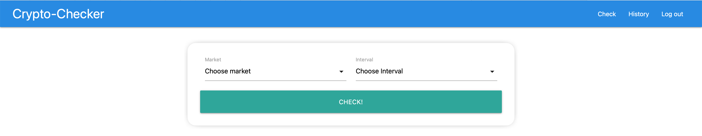
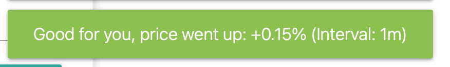

# Crypto-Checker ([Demo](https://crypto--checker.herokuapp.com))
_Project purpose: learn how to use JWT authorizarion, create custom hooks and using third paries APIs_

## Functionality
+ Registration
+ Authorization
+ Crypto currency price checking
+ Comparing current price to the one that was during previous check

## Technologies

+ React
+ React Context
+ React Hooks
  + useState
  + useEffect
  + useCallback
  + Custom hooks
    + useAuth - for authorization checking
    + useHttp - for requests sending
    + useMessage - for displaying MaterializeCSS toasts
+ React Router
+ Materialize CSS
+ Node.js
+ Express
+ MongoDB & Mongoose

### Sign in / Sign up page

### Main page

### Market choosing

### Interval choosing

### Start price tracking toast

### Price change info toast (good)

### Price change info toast (bad)

### History page

